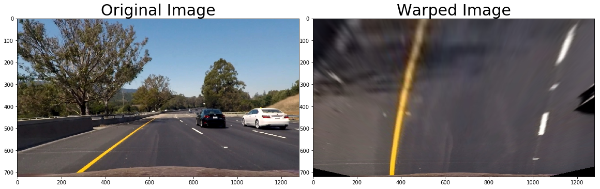

## Advanced Lane Lines

### Project 4

---

**Advanced Lane Finding Project**

The goals / steps of this project are the following:

* Compute the camera calibration matrix and distortion coefficients given a set of chessboard images.
* Apply a distortion correction to raw images.
* Use color transforms, gradients, etc., to create a thresholded binary image.
* Apply a perspective transform to rectify binary image ("birds-eye view").
* Detect lane pixels and fit to find the lane boundary.
* Determine the curvature of the lane and vehicle position with respect to center.
* Warp the detected lane boundaries back onto the original image.
* Output visual display of the lane boundaries and numerical estimation of lane curvature and vehicle position.

## [Rubric](https://review.udacity.com/#!/rubrics/571/view) Points

### Here I will consider the rubric points individually and describe how I addressed each point in my implementation.  

---

### Writeup / README

#### 1. Provide a Writeup / README that includes all the rubric points and how you addressed each one.  You can submit your writeup as markdown or pdf.  [Here](https://github.com/udacity/CarND-Advanced-Lane-Lines/blob/master/writeup_template.md) is a template writeup for this project you can use as a guide and a starting point.  

You're reading it!

### Camera Calibration

#### 1. Briefly state how you computed the camera matrix and distortion coefficients. Provide an example of a distortion corrected calibration image.

In `Step 1 - Camera calibration` of my `project4.ipynb` notebook, I use the given distorted checkerboards images to create camera calibration valued in my pipeline. The checkerboard provides a great way to calibrate the camera as it has a known shape and high contrast.

To do this, first I prepare a 9x6x1 (object points) grid full of points and load all the images. Then for each image I convert to grayscale and use `cv2.findChessboardCorners` to find any corners. If corners are found, I save them along with the known grid.

Using the `cv2.calibrateCamera` method with the object points, the found image points, and the image shape, I'm able to get the camera matrix, distortion coefficients and pickle/save them for later use.

You can view all the undistorted checkerboards here: `output_images/undistorted*.jpg`

### Pipeline (single images)

#### 1. Provide an example of a distortion-corrected image.

In `Step 2 - Distortion correction` of my `project4.ipynb` notebook, I define the `undistort` function. This function uses the saved calibration data (from above) to undistort the camera images.

#### 2. Describe how (and identify where in your code) you used color transforms, gradients or other methods to create a thresholded binary image.  Provide an example of a binary image result.

In `Step 3 -- Color/gradient threshold` of my `project4.ipynb` notebook, I define the `apply_gradient` function. This function is comprised of three other functions - `mag_thresh`, `dir_thresh` and `color_thresh` - that are combination of color and gradient thresholds to generate a binary image.

In parallel a apply the gradient threshold (gradient magnitude & gradient direction) while also applying a color threshold in HLS color space. I then combine the two parallel (three in total) thresholds to create the binary image.

#### 3. Describe how (and identify where in your code) you performed a perspective transform and provide an example of a transformed image.

In `Step 4 -- Perspective transform` of my `project4.ipynb` notebook, I define the `shift_perspective` function.  I chose to hardcode the source and destination points using smart assumptions and then using `cv2.getPerspectiveTransform` get the transformation matrix `M` and apply that to the warped binary image.

#### 4. Describe how (and identify where in your code) you identified lane-line pixels and fit their positions with a polynomial?

In `Step 5 -- Detect lane lines` of my `project4.ipynb` notebook, I define the `detect_lines` function. This function uses a sliding histogram method on a warped binary image to detect the lane-lines (histogram spikes) and plot their position. The histogram then continues up the image plotting the histogram spikes. After it has finished sliding (9 slides altogether to cover the image), it creates a bit-fit polynomial of the left and right lane-lines.

#### 5. Describe how (and identify where in your code) you calculated the radius of curvature of the lane and the position of the vehicle with respect to center.

In `Step 6 -- Determine the lane curvature` of my `project4.ipynb` notebook, I define the `calc_roc` function. This function returns a radius of curvature for the left lane-line and the right lane-line and a mean of the two.

#### 6. Provide an example image of your result plotted back down onto the road such that the lane area is identified clearly.

In `Step 7 -- Plotting Pipeline onto a Test Image` of my `project4.ipynb` notebook, I define the `draw_mask` function. This function returns a green masking on the original image of the lane ahead along with a print out of the Radius of Curvature and the Vehicle Distance from Center.

---

### Pipeline (video)

#### 1. Provide a link to your final video output.  Your pipeline should perform reasonably well on the entire project video (wobbly lines are ok but no catastrophic failures that would cause the car to drive off the road!).

Watch my [video result](./project_video_masked.mp4).

---

### Discussion

#### 1. Briefly discuss any problems / issues you faced in your implementation of this project.  Where will your pipeline likely fail?  What could you do to make it more robust?

I learned a lot from this project.

1) I absolutely needed to use the AWS GPU to do the image processing, my personal computer (CPU) wasn't powerful enough.

2) This project was about image processing and not neural networks. So I got good exposure to image manipulation tasks, especially applying gradients.

3) My pipeline's generated mask gets a little distorted in the video on the bridge where the left lane-line disappears. More work could be done to learn how to handle those situations better. Likewise, I could experiment with how to teach my pipeline to handle lanes that may have an inadvertent 'line' in the middle of them (like a road under construction).
